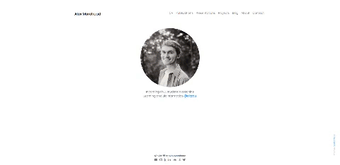

    <h1>Alex Morehead's Portfolio</h1>
    <i>My personal portfolio built using portfolYOU, a beautiful portfolio Jekyll theme that works with GitHub Pages.</i>
      
    
     
    © 2020 portfolYOU, licensed under the <a href="./LICENSE">MIT License</a>.

